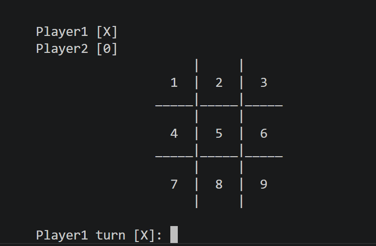

# 🎮 Tic-Tac-Toe (C++)

A simple console-based **Tic-Tac-Toe** game built in **C++** for two players. Players take turns placing **X** and **O** on a 3×3 board until one player wins or the game ends in a draw.

## 📸 Output

<p align="center">
  
</p>

> Save your screenshot as `output.png` inside an `images` folder.

## ✨ Features

- Two-player gameplay
- 3×3 interactive board
- Win and draw detection
- Console-based interface
- Beginner-friendly C++ project

## 🛠️ Built With

- C++
- Standard Library (`iostream`)

## 🚀 Run

Compile:

```bash
g++ tic_tac_toe.cpp -o tic_tac_toe
```

Run:

```bash
./tic_tac_toe
```

## 👨‍💻 Author

**Ayaan Hayat**

GitHub: https://github.com/ayaanhayatkhan